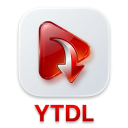
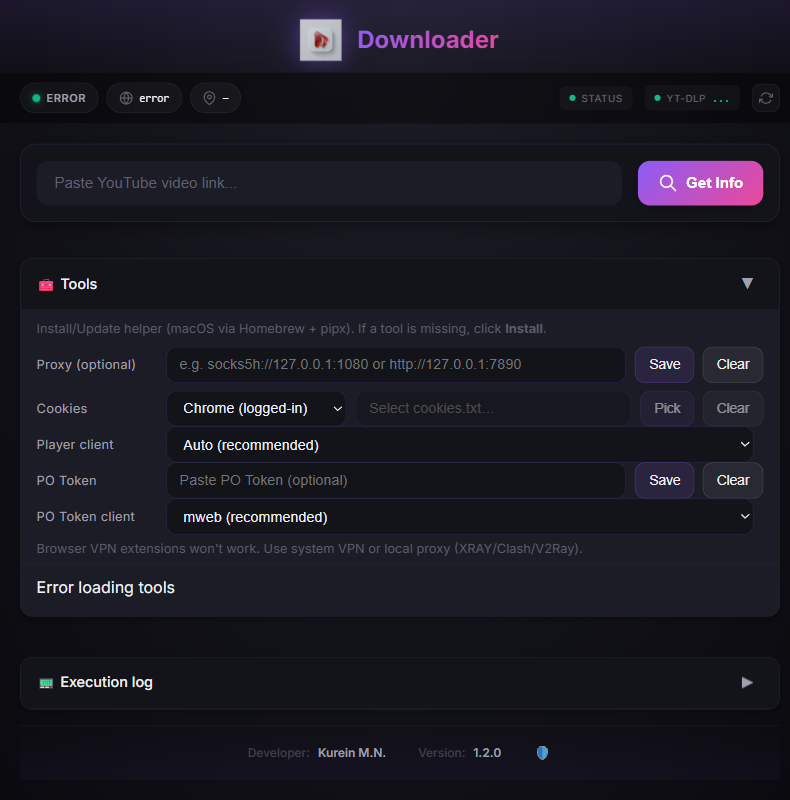
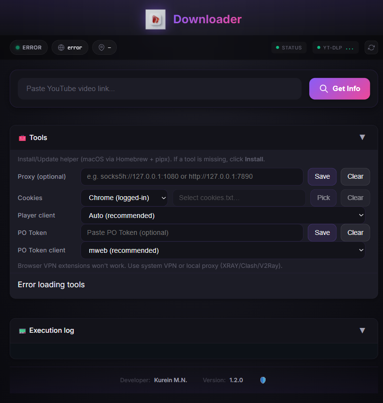

# YouTube Downloader v1.6.1

Language: **English** · [Русский](README_ru.md)

<p align="center">
  
</p>

<p align="center">
  <strong>A modern desktop app for downloading YouTube videos on macOS and Windows.</strong><br>
  Tauri + Rust + yt-dlp — no cloud, no account.
</p>

<p align="center">
  <a href="https://github.com/kureinmaxim/ProjectYouTube/releases"></a>
  <a href="LICENSE"></a>
  
  
</p>

<p align="center">
  
</p>

## Features

- **Modern UI** — dark mode with gradients and animation
- **Simple download** — paste a link and save
- **Quality picker** — Best, 1080p, 720p, 480p, MP3
- **Live progress** — visual progress bar
- **Chrome cookies** — automatic support for private videos
- **Folder picker** — save wherever you want
- **Auto fallback** — YouTube block bypass (android / tv / web clients)
- **Network status** — auto-detect mode (TUN / SOCKS5 / Direct)
- **Diagnostics** — external IP, proxy check, yt-dlp freshness
- **System proxy** — HTTP/SOCKS detection on macOS
- **Offline UI** — fonts and styles are bundled; the window paints without a network

<p align="center">
  
</p>

## Quick start

```bash
git clone https://github.com/kureinmaxim/ProjectYouTube.git
cd ProjectYouTube
```

### Install dependencies

```bash
cd youtube-downloader
npm install
```

### Run in dev mode

```bash
# From the repo root
make dev

# Or from youtube-downloader/
cd youtube-downloader
npm run tauri dev
```

### Release build

```bash
# From the repo root
make build

# Output:
# youtube-downloader/src-tauri/target/release/bundle/macos/youtube-downloader.app
# youtube-downloader/src-tauri/target/release/bundle/dmg/*.dmg

# Install into /Applications
make install-app
```

> Pin the copy from `/Applications` (`make install-app`) in the Dock — not the `.app` under `target/`, and not a dev build. `target/` is deleted on every rebuild; a dev binary needs the Vite server running.
> If the window opens empty and white, see [MACOS_SETUP.md](MACOS_SETUP.md), section “The app opens as a blank white window”.

Windows (no Makefile required):

```powershell
cd youtube-downloader
npm install
npm run tauri dev
```

## Requirements

- **macOS** 11.0+ or **Windows** 10/11
- **Node.js** 18+
- **Rust** 1.70+
- **Google Chrome** (optional, for cookies)

yt-dlp and ffmpeg are **not** prerequisites — open the **Tools** panel and click **Install**.

### Tools panel

Both tools are listed there with their version and status.

**Windows** — Install downloads the binary from GitHub releases into
`%LOCALAPPDATA%\youtube-downloader\bin`. No package manager, no admin rights, no PATH
change and no restart. ffmpeg is ~170 MB, so its progress is logged as it downloads.

**macOS** — Install uses Homebrew:

```bash
brew install yt-dlp ffmpeg
```

Already have them from Scoop, Chocolatey, winget, pip or Homebrew? The app finds and uses
that copy. **Update** will not overwrite it — it names the owner and prints the command
that updates it.

## Dev commands

| Command | What it does |
|---------|----------------|
| `make help` | List all commands |
| `make dev` | Run in dev mode |
| `make build` | Release build |
| `make install-app` | Install the `.app` into `/Applications` |
| `make run` | Launch the installed app |
| `make run-verbose` | Launch with logs in the terminal (blank-window debugging) |
| `make clean` | Delete build artifacts |
| `make test` | Run tests |
| `make lint` | Lint the code |

## Version management

```bash
# Current version
make version-status

# Sync versions in all files
make version-sync

# Bump
make version-bump-patch    # 1.6.0 → 1.6.1
make version-bump-minor    # 1.6.0 → 1.7.0
make version-bump-major    # 1.6.0 → 2.0.0

# Set a specific version
make version-set v=1.0.0
```

Details: [VERSION_MANAGEMENT.md](VERSION_MANAGEMENT.md)

## Docs

- [Index](docs/INDEX_ru.md) (Russian long-form)
- [BUILD.md](BUILD.md) — build and development · [RU](BUILD_ru.md)
- [MACOS_SETUP.md](MACOS_SETUP.md) — macOS · [RU](docs/MACOS_SETUP_ru.md)
- [WINDOWS_SETUP.md](WINDOWS_SETUP.md) — Windows · [RU](docs/WINDOWS_SETUP_ru.md)
- [NETWORK_SETUP.md](NETWORK_SETUP.md) — network, VPN, DNS · [RU](docs/NETWORK_SETUP_ru.md)
- [YOUTUBE_BLOCKING.md](YOUTUBE_BLOCKING.md) — SABR, 403, PO Token
- [docs/PROJECT_OVERVIEW_ru.md](docs/PROJECT_OVERVIEW_ru.md) — architecture overview (Russian)
- [docs/ARCHITECTURE_2026_ru.md](docs/ARCHITECTURE_2026_ru.md) — blocking-bypass architecture (Russian)
- [CHANGELOG.md](CHANGELOG.md)

## Project layout

```
ProjectYouTube/
├── youtube-downloader/       # Main app
│   ├── src/                  # Frontend (TypeScript, CSS)
│   │   ├── main.ts          # App logic
│   │   └── styles.css       # Styles
│   ├── src-tauri/           # Backend (Rust)
│   │   └── src/
│   │       ├── lib.rs       # Entry module
│   │       ├── ytdlp.rs     # yt-dlp + fallback
│   │       └── downloader/  # Download module
│   │           ├── utils.rs       # Network detection (TUN/SOCKS5/IP)
│   │           ├── platform.rs    # Per-OS binary discovery + install dir
│   │           ├── tools.rs       # yt-dlp / ffmpeg install and update
│   │           ├── commands.rs    # Tauri commands
│   │           └── backends/      # Download backends
│   └── index.html           # HTML UI
├── scripts/                  # Utilities
│   └── version.py           # Version sync
├── Makefile                 # Dev commands
└── docs/                    # Docs and screenshots
```

## Usage

1. **Start the app**
2. **Paste a YouTube URL** into the input
3. **Click "Get Info"** — you will see the video preview
4. **Pick quality** (default 720p)
5. **Pick a folder** to save into
6. **Click "Download Video"**
7. **Watch the progress** bar
8. **Done.** The file is in the folder you chose.

## PO Token and player client

The **Tools** block has extra YouTube settings (if a download hangs on SABR / blocks):

- **Player client** — force a yt-dlp client.
  - `Auto` — recommended; uses built-in strategies and fallback.
  - `all` — tries every client (often helps with blocks).
- **PO Token** — paste a PO Token (if YouTube requires one for GVS).
- **PO Token client** — which client the token is for (usually `mweb`).

### How to apply

1. Open **Tools** and choose **Player client** (`Auto` or `all`).
2. If you have a PO Token, paste it and set **PO Token client** to `mweb`.
3. Start the download — the chosen parameters are used automatically.

> If you see SABR / 403, try `all` and/or **PO Token (mweb)**.
>
> PO Token guide: https://github.com/yt-dlp/yt-dlp/wiki/PO-Token-Guide

### How to get a PO Token (mweb)

Short version of the official yt-dlp guide:

1. Open **YouTube Music** in a browser and sign in.
2. Open DevTools → **Network**.
3. Filter requests for `v1/player`.
4. Play any video — a `player` request appears.
5. In the request body, copy `serviceIntegrityDimensions.poToken`.
6. Paste it into **PO Token** in the app, set **PO Token client = mweb**.

### Typical errors

- **SABR / 403 / Forbidden** — usually another client (`all`) and/or a PO Token (`mweb`).
- **Network timeout / timed out** — try a VPN/proxy or change IP. If the status bar shows `IP: N/A`, it is often DNS: [NETWORK_SETUP.md](NETWORK_SETUP.md).
- **Requested format is not available** — pick `Best` or `audio`.
- **Private / age-restricted** — enable cookies (Chrome) or use cookies.txt.

## Stack

- **Tauri** 2.0 — desktop framework
- **Rust** — backend
- **TypeScript** — frontend logic
- **Vite** — dev server
- **yt-dlp** — video download

## License

[MIT](LICENSE)

---

Kurein M.N.
